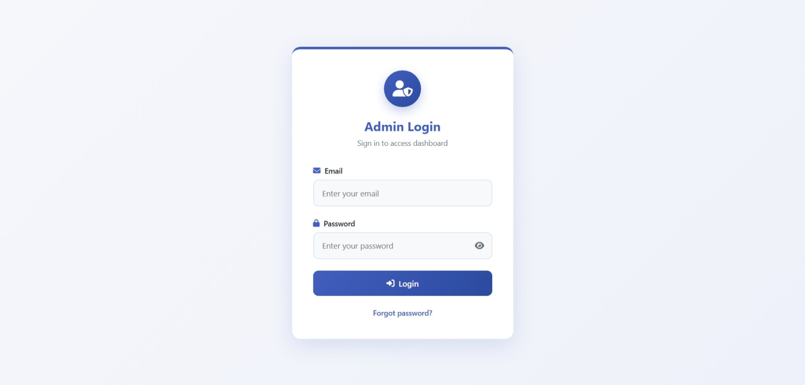
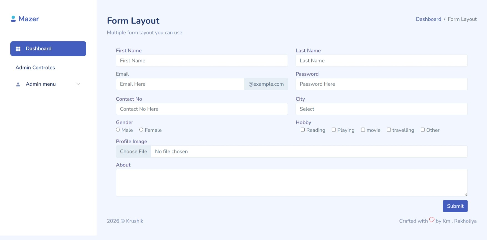
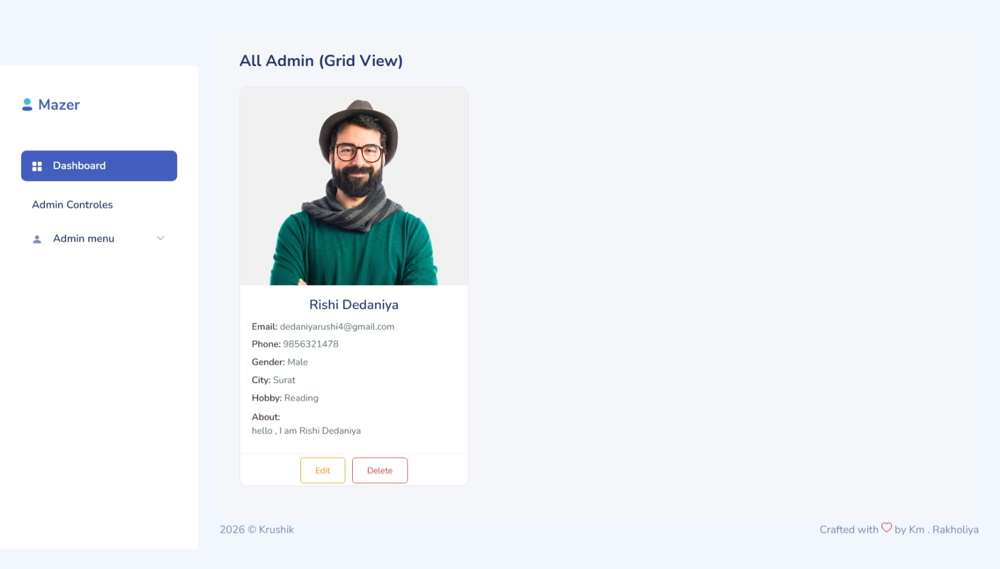
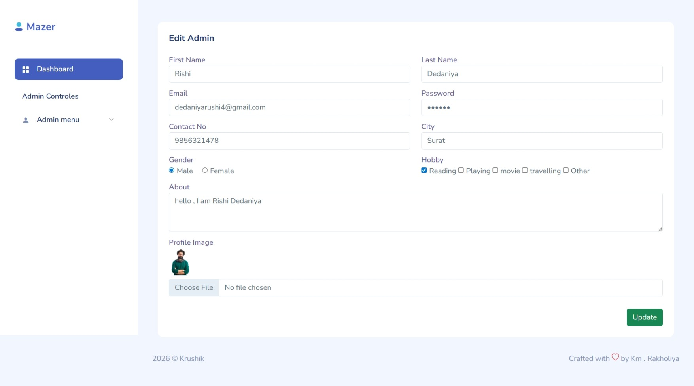
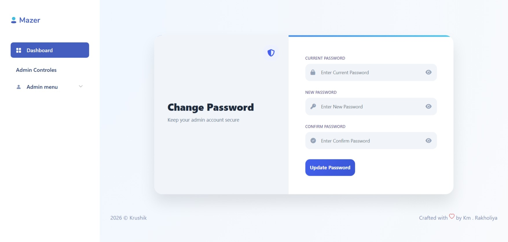
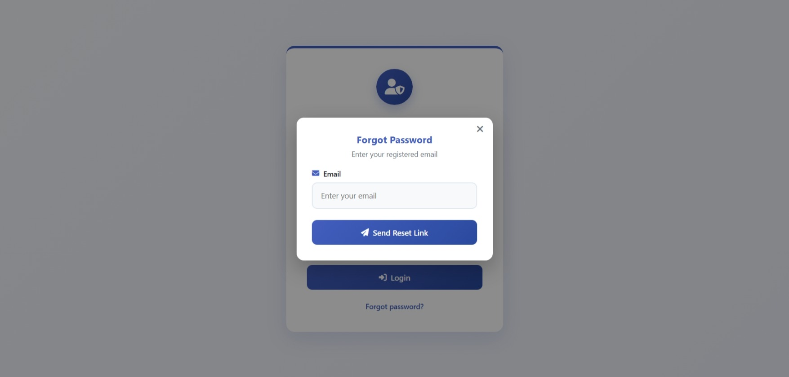
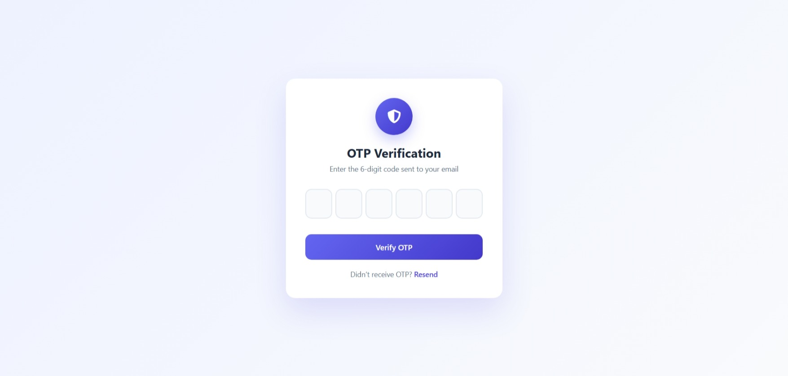
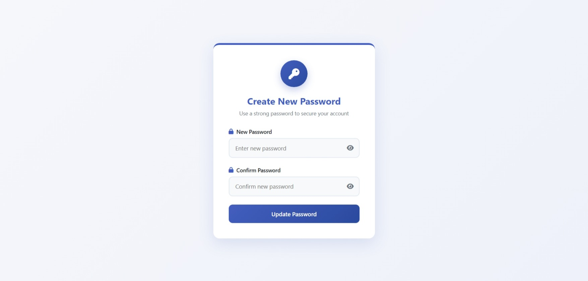

# 🚀 Advanced Admin Panel System (Node.js + Express + MongoDB + EJS)

A complete, production-style **Admin Panel Web Application** with authentication, OTP-based password recovery, profile management, image upload, and admin role management.

---

## 📸 Project Preview (Screenshots)

> Add your real screenshots in this folder:

```
/docs/images/
```

### 🔐 Login Page



### 📊 Dashboard


### 👤 Profile Page


### ➕ Add Admin



### 📋 View Admin (Grid)



### ✏️ Edit Admin



### 🔑 Change Password



### 🔢 OTP Verification





---

## 🧩 Major Modules

### 1️⃣ Authentication System

* Admin Login
* Logout
* Cookie-based authentication
* Session-like behavior using cookies

### 2️⃣ Forgot Password + OTP Flow

* Email verification
* OTP generation
* OTP verification page
* Create new password

### 3️⃣ Admin Profile Management

* View own profile
* Edit profile
* Upload profile image

### 4️⃣ Admin Management System

* Add new admin
* View all admins (Grid View)
* Edit admin
* Delete admin

### 5️⃣ Dashboard

* Statistics cards
* Charts (ApexCharts)
* Recent messages UI

---

## 🛠 Tech Stack

### Backend

* Node.js
* Express.js
* MongoDB
* Mongoose ODM

### Frontend

* EJS Template Engine
* Bootstrap 5
* Custom CSS
* Font Awesome Icons

### Utilities

* Multer (File Upload)
* Nodemailer (OTP & Email)
* Cookie-Parser

---

## 📂 Complete Project Structure

```
project-root/
│
├── app.js
├── package.json
├── config/
│   └── db.config.js
│
├── controllers/
│   └── admin.controller.js
│
├── model/
│   └── admin.model.js
│
├── routes/
│   └── index.js
│
├── uploads/
│   └── admin/
│       └── (profile images)
│
├── public/
│   └── assets/
│       ├── css/
│       ├── js/
│       ├── images/
│       └── vendors/
│
├── views/
│   ├── auth/
│   │   ├── login.ejs
│   │   ├── OTPPage.ejs
│   │   ├── newPasswordPage.ejs
│   │   └── changePasswordPage.ejs
│   │
│   ├── profile/
│   │   └── profilePage.ejs
│   │
│   ├── dashboard.ejs
│   ├── addAdminPage.ejs
│   ├── viewAdminPage.ejs
│   ├── editAdminPage.ejs
│   ├── header.ejs
│   └── footer.ejs
│
└── docs/
    └── images/
```

---

## 🔐 Authentication Flow

```text
Login Page
   ↓
Check Email & Password
   ↓
Set Cookie (adminId)
   ↓
Redirect to Dashboard
```

---

## 🔁 Forgot Password + OTP Flow

```text
Forgot Password
   ↓
Verify Email
   ↓
Send OTP (Nodemailer)
   ↓
OTP Verification Page
   ↓
Create New Password
   ↓
Login Again
```

---

## 📷 Profile Image Upload (Multer)

Images are stored in:

```
/uploads/admin/
```

Multer Config:

```js
const storage = multer.diskStorage({
  destination: (req, file, cb) => cb(null, 'uploads/admin/'),
  filename: (req, file, cb) => cb(null, Date.now() + '-' + file.originalname)
});
```

---

## 📧 Email (OTP) Configuration

In `admin.controller.js`:

```js
let transporter = nodemailer.createTransport({
  service: 'gmail',
  auth: {
    user: 'your-email@gmail.com',
    pass: 'your-app-password'
  }
});
```

⚠️ Important:

* Use Gmail App Password
* Never use your real Gmail password

---

## 🗄 Database Schema (Admin)

```js
const adminSchema = mongoose.Schema({
  fname: String,
  lname: String,
  email: String,
  password: String,
  phone: String,
  gender: String,
  hobby: Array,
  city: String,
  about: String,
  profile_image: String
});
```

---

## ▶️ Installation & Setup

### Step 1: Clone Project

```bash
git clone https://github.com/your-username/admin-panel.git
```

### Step 2: Install Dependencies

```bash
npm install
```

### Step 3: Setup MongoDB

Update:

```
config/db.config.js
```

### Step 4: Run Server

```bash
node app.js
```

Server URL:

```
http://localhost:8780
```

---

## 🔒 Security Improvements (Recommended)

❌ Current System:

* Plain text passwords
* Cookie without httpOnly/secure flags

✅ Recommended for Production:

* bcrypt (password hashing)
* JWT or express-session
* CSRF protection
* Input validation
* Rate limiting

---

## 🧪 Test Accounts (Optional)

You can manually insert admin in MongoDB for testing:

```json
{
  "fname": "Super",
  "lname": "Admin",
  "email": "admin@example.com",
  "password": "123456",
  "city": "Mumbai"
}
```

---

## 🧾 Environment Variables (Recommended)

Create `.env` file:

```env
PORT=8780
MONGO_URI=mongodb://localhost:27017/adminpanel
EMAIL_USER=your@gmail.com
EMAIL_PASS=app-password
```

---

## 📌 Future Enhancements

* Role-based access (Super Admin, Sub Admin)
* Activity logs
* Admin permissions
* Pagination for admin list
* Search & filter admins
* Two-factor authentication (2FA)

---

## 👨‍💻 Author

**Krushik**
Crafted with ❤️ by Km. Rakholiya

---

## 📄 License
##  MIT License
This project is licensed under the [MIT License](https://github.com/MrKrushik/License).
